# Урок 8. Типы архитектур прикладных приложений (мобильные): MVC, MVP, MVVM.
## Classwork
### MVC

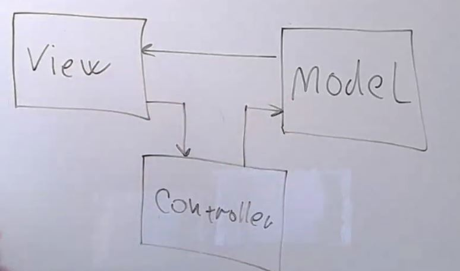

### MVP

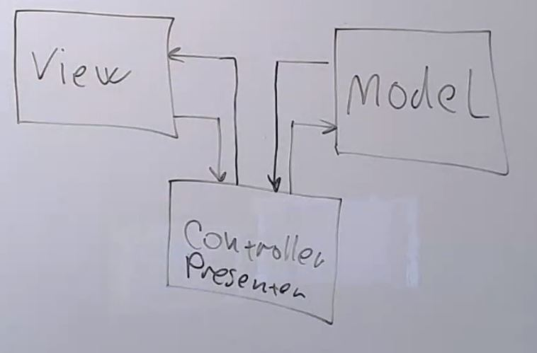

### Разделение на frontend и backend

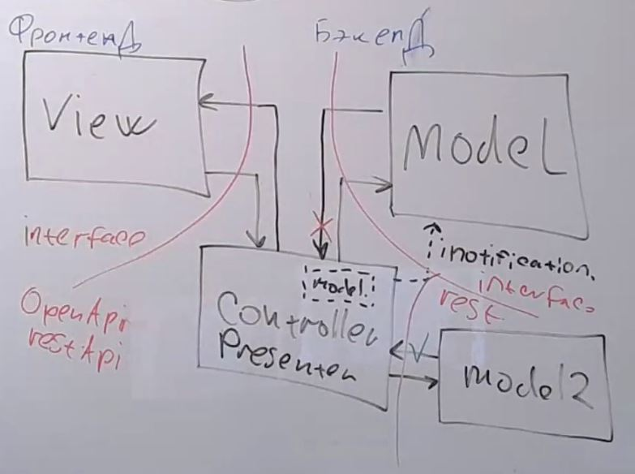

### MVVM до Microsof

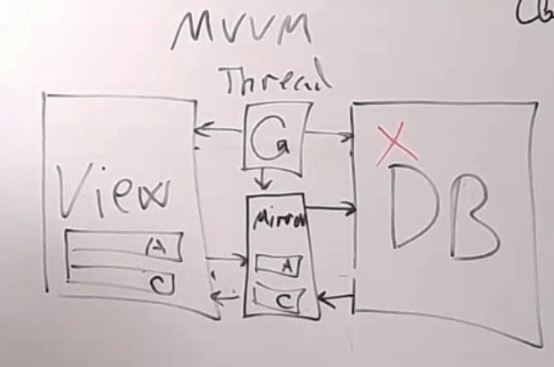 

### MVVM после Microsof

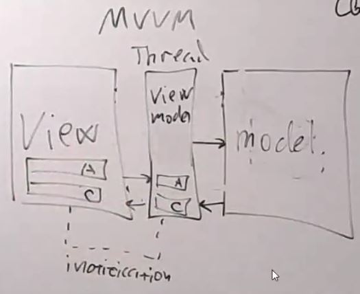

### Современные фреймворки
REACTNATIVE

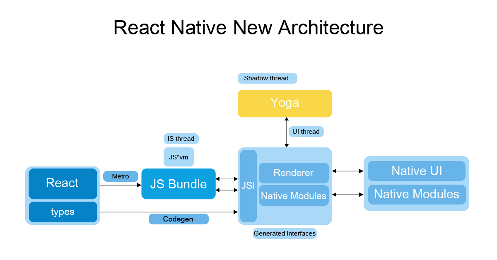

FLUTTER

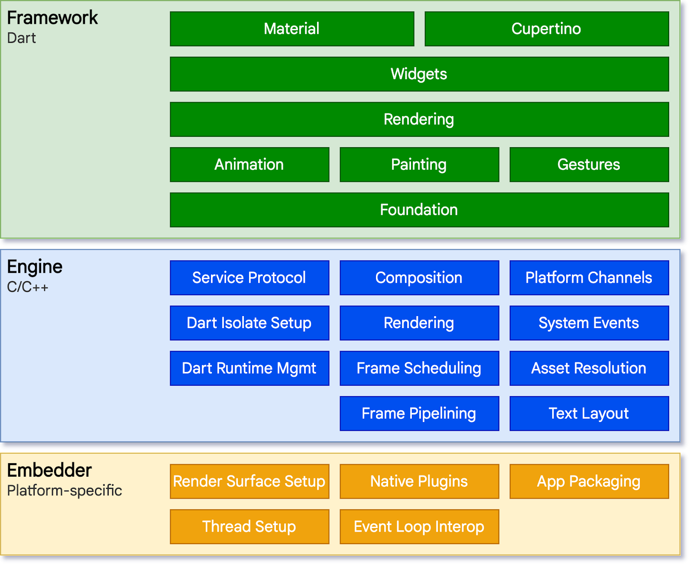

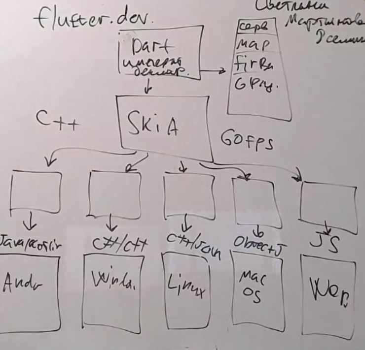

MAUI

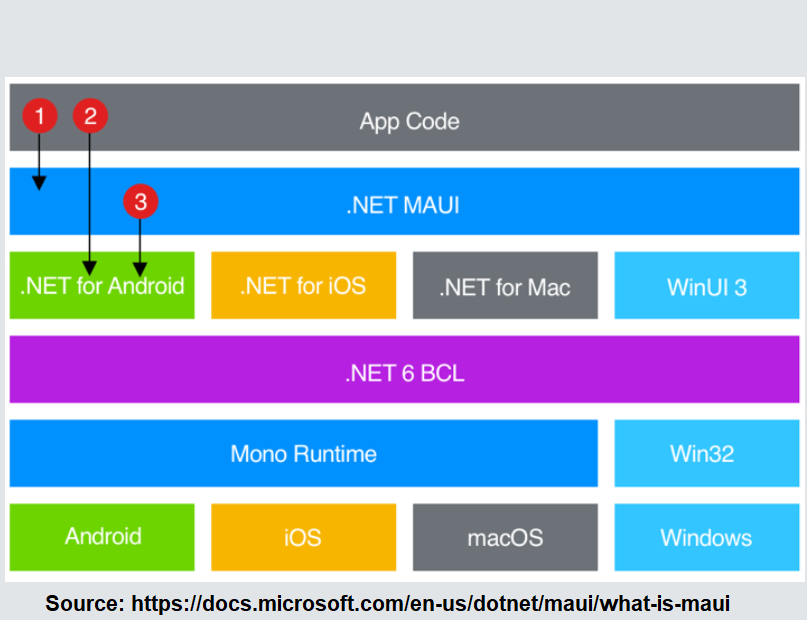

## Homework
Для приложения заказа столика в ресторане сделать архитектурные документы:
1) Разработать экранные формы интерфейса(UI/UX) в https://www.figma.com/ или https://app.diagrams.net/.

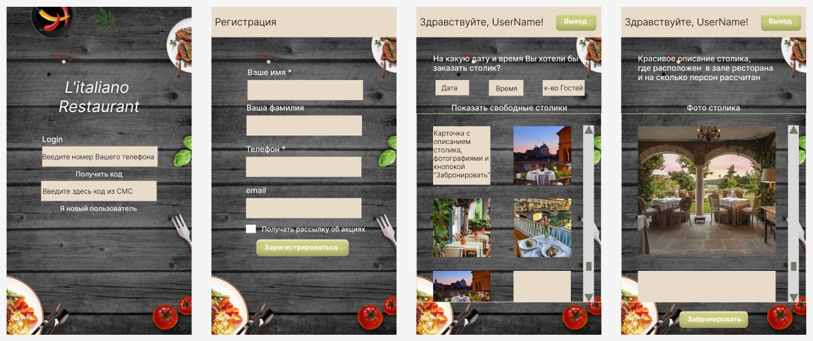

2) Разработать полную ERD домена в https://www.dbdesigner.net/.

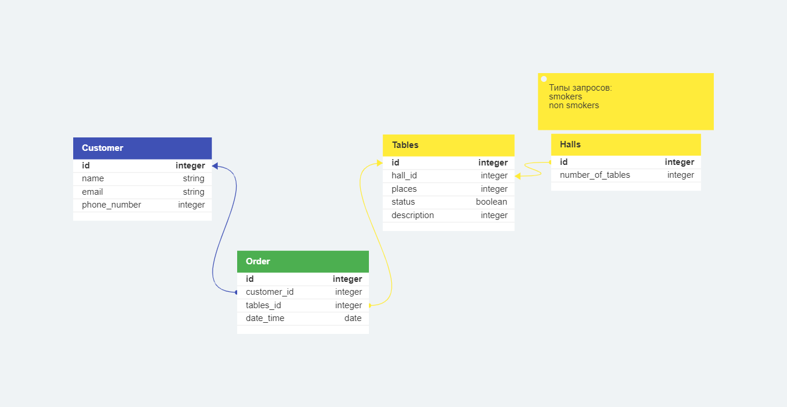

3) Разработать UML диаграмму классов.

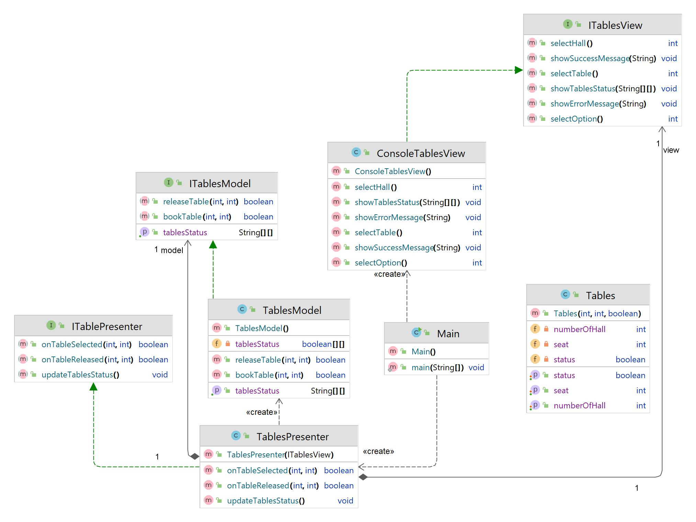